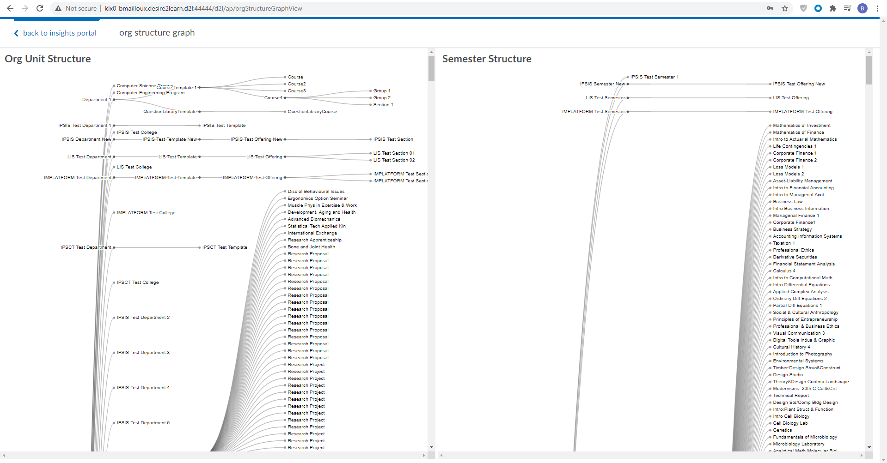

# inspiration-org-structure-graph
Inspiration - A visual graph of the org structure for an LMS instance



### Development
* Get LMS changes from [this branch](https://github.com/Brightspace/lms/compare/bmailloux/inspiration202011/org-unit-visualization?expand=1), 
or if that branch has been trimmed check the 
[trash bin](https://github.com/Brightspace/lms-trash-bin)
* In your local BSI, make the following changes
  * In package.json, add an entry for `"inspiration-org-structure-graph": "github:Brightspace/inspiration-org-structure-graph#semver:^0",`
  * In rollup-wc.config.js, add
  ```
  const appFiles = [
    ...
    './node_modules/d2l-org-structure-graph/orgStructureGraph.js',
	...
  ];
  ```
  * run `npm install` in BSI
  * Follow the additional steps in the BSI readme to hook it up to your local LMS
* Run `npm install` in this folder
* For "live" changes, `npm link` this folder to your local BSI
